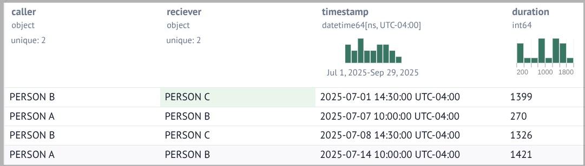
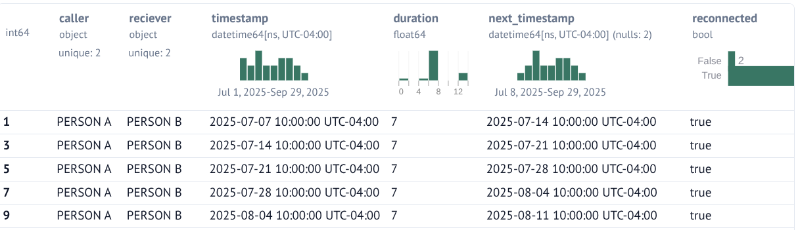
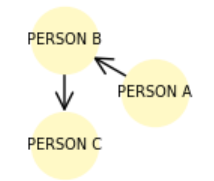
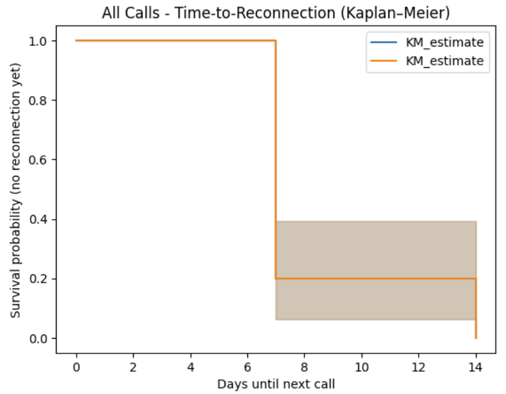
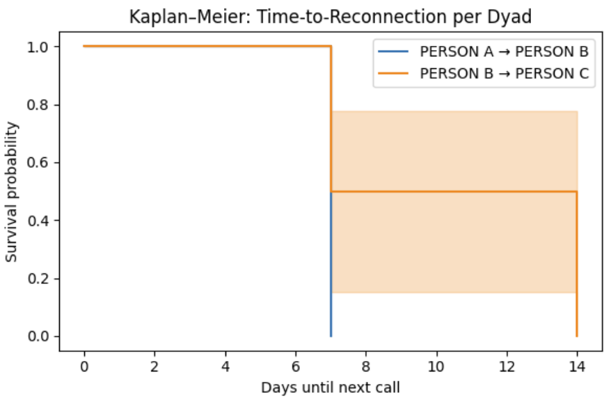

# Mapping Relationship Tempo Using Call Data and Lifelines

Analyze the rhythm of human communication using survival analysis with Python's Lifelines library. Model and visualize how long it takes for phone numbers to reconnect using call data. Explore relationship "tempos" through Kaplan–Meier curves, network graphs, and FOAF (Friend of a Friend) group analysis.

## Overview

This project applies survival analysis techniques to call data records (CDR) to understand the temporal patterns of human relationships. By treating the time between calls as a survival problem, we can model and visualize:

- **Time-to-reconnect**: How long does it take for two phone numbers to reconnect after their last communication?
- **Relationship tempo**: What is the natural "rhythm" of communication between individuals?
- **Network dynamics**: How do communication patterns differ across social groups and clusters?

## Features

- **Survival Analysis**: Use Kaplan-Meier estimators and Cox proportional hazards models to analyze reconnection times
- **Network Visualization**: Generate network graphs to explore communication patterns and social structures
- **FOAF Analysis**: Identify and analyze Friend-of-a-Friend groups within call data
- **Temporal Patterns**: Visualize how communication frequency changes over time
- **Statistical Modeling**: Apply lifelines library for robust survival analysis

## Data Preparation

### Data Format

Your call data should include:
- **caller**: Phone number initiating the call
- **receiver**: Phone number receiving the call
- **timestamp**: Date and time of the call
- **duration** (optional): Length of the call

Example CSV format:
```csv
caller,reciever,timestamp,duration
PERSON B,PERSON C,2025-07-01T14:30:00-04:00,1399
PERSON A,PERSON B,2025-07-07T10:00:00-04:00,270
PERSON B,PERSON C,2025-07-08T14:30:00-04:00,1326
```

This CSV snippet shows three calls between three people.

- Person B calls Person C on July 1st for 1399 seconds.
- Person A calls Person B on July 7th for 270 seconds.
- Person B calls Person C on July 8th for 1326 seconds.

Note that the caller and reciever fields can be any values that unique identifies the two parties in the call. You might find it more convenient to use phone numbers or some other identifier.

## Derived Fields Needed For Survial Analysis

The raw data has just four fields: caller, reciever, timestamp, and duration. In order for the survival analysis to be run some fields need to be derived.

- next_timestamp - This is the time of the next interaction between the caller and reciever. The data needs to be reordered in order to find this datum for each interaction.
- reconnected - This is true if the current interaction is followed by another. If this is true, then there must be a value in the next_timestamp field.

## Usage

These are Marimo notebooks. For more information, see <https://marimo.io/>.

- nb-load-cdr-data.py - This notebook shows how to read the raw CSV file.


*Raw Data*

- nb-show-transformed-data.py - This notebook transforms the raw data into the format needed for the survival analysis to be run.


*Transformed Data*

- nb-draw-network-from-cdr-data.py - This notebook shows how the two people in the interactions are related. Note the arrows depict the caller-callee relationship. This code is very primitive. For example, it won't handle a bi-directional relationship nicely when caller A calls caller B and vice versa.

<br/>
*Show The Caller-Callee Relationships*

- nb-plot-time-to-reconnection.py - This notebook uses Kaplan-Meier to plot the time to reconnection for all caller-callee interactions and per caller-callee combinations.


*Time To Reconnect For All Caller-Callee Combinations*


*Time To Reconnect For Each Caller-Callee Combinations*

## Methodology

### Survival Analysis for Communication

Traditional survival analysis studies "time until an event occurs." In this project:
- **Event**: A reconnection between two phone numbers
- **Time**: Days/hours since their last communication
- **Censoring**: Ongoing relationships without a defined endpoint

### Kaplan-Meier Curves

Kaplan-Meier curves estimate the probability that two numbers will maintain silence (not reconnect) over time. A steep drop indicates frequent reconnections; a gradual decline suggests longer gaps between communications.

### FOAF (Friend of a Friend) Analysis

By building a network graph where nodes represent phone numbers and edges represent calls, we can:
1. Identify clusters of closely connected individuals
2. Find FOAF relationships (friends of friends who don't directly communicate)
3. Analyze how information might spread through the network

## Use Cases

- **Social Network Research**: Study communication patterns in communities
- **Customer Relationship Management**: Identify customer engagement patterns
- **Fraud Detection**: Detect unusual communication patterns
- **Marketing Analytics**: Understand customer retention and churn
- **Telecommunications**: Analyze network usage and customer behavior

## Contributing

Contributions are welcome! Please feel free to submit a Pull Request. For major changes, please open an issue first to discuss what you would like to change.

1. Fork the repository
2. Create your feature branch (`git checkout -b feature/AmazingFeature`)
3. Commit your changes (`git commit -m 'Add some AmazingFeature'`)
4. Push to the branch (`git push origin feature/AmazingFeature`)
5. Open a Pull Request

## License

This project is licensed under the MIT License - see the [LICENSE](LICENSE) file for details.

## Acknowledgments

- [Lifelines](https://lifelines.readthedocs.io/) - Python library for survival analysis
- [Matplotlib](https://matplotlib.org/) - a library for visualizations
- [NetworkX](https://networkx.org/) - Network analysis library
- [Pandas](https://pandas.pydata.org/) - an open source data analysis tool
- Research in social network analysis and survival analysis methodologies

## References

- Kaplan, E. L., & Meier, P. (1958). Nonparametric estimation from incomplete observations
- Davidson-Pilon, C. (2019). lifelines: survival analysis in Python
- Newman, M. E. J. (2010). Networks: An Introduction

## Contact

David Medinets - [@medined](https://github.com/medined) - <david.medinets@gmail.com>
